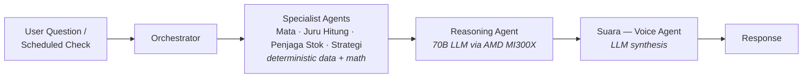

# Kira — AI Co-Pilot for Indonesian Small Businesses

> Proactive AI co-pilot for 60M+ Indonesian warung/UMKM owners, built for **AMD Developer Hackathon ACT II** (Unicorn Track).

[](https://www.python.org/)
[](https://fastapi.tiangolo.com/)
[](https://firebase.google.com/)
[](https://www.docker.com/)
[](#license)
[](https://kira-ai.up.railway.app)

## Live Demo

- **Application:** [kira-ai.up.railway.app](https://kira-ai.up.railway.app) *(verify this is current before sharing — Railway URLs can change on redeploy)*
- **GitHub:** this repo
- **Team:** Hearz — AMD Developer Hackathon ACT II, Unicorn Track

## The Problem

Over 60 million Indonesian micro and small business owners (warung, UMKM) run their business on intuition and paper notes, not data. They often don't discover a cash crunch or a money-losing product until it's too late. Existing bookkeeping apps are *reactive* — you have to remember to open them and ask the right question — and many assume a level of literacy and accounting knowledge that these owners don't have.

## What Kira Does

Kira is **proactive, not reactive**. It monitors the business continuously and surfaces the most urgent issue before it becomes a crisis, in natural conversational Indonesian or English, through simple chat rather than complex menus or spreadsheets.

Core capabilities:

- **Hybrid receipt OCR** — reads receipts from a photo using local Tesseract first, escalating to cloud vision only when local confidence is low, to keep cost near zero for the common case
- **Inventory tracking & stockout prediction** — flags items about to run out based on real usage rate, not guesswork
- **Automatic financial reporting** — computes P&L from real transaction history and flags losing or thin-margin products
- **Proactive alerts** — surfaces the single most urgent issue (cash runway, stockout, losing product) without being asked
- **Internal-data-only forecasting** — cash runway and revenue trend projections are derived exclusively from the business's own transaction history, never speculative external market prediction. This is a deliberate design choice for accuracy and trustworthiness — Kira will not tell a warung owner what "the market" might do
- **Bilingual by design** — Indonesian and English, aimed at low-friction daily use

## Architecture — Multi-Agent System

Kira is built as an orchestrator coordinating six specialist agents. Reactive requests (a user asking a question) and proactive checks (scheduled monitoring) both flow through this pipeline, though proactive checks skip routing and call the reasoning agent directly.

1. **Orchestrator** — a LangGraph state machine (`intake → route → dispatch_agents → synthesize`) that routes each request to the right specialist agent(s)
2. **Mata** (`eyes_agent`) — hybrid OCR for receipt photos: local Tesseract first, cloud vision fallback only when needed
3. **Juru Hitung** (`bookkeeper_agent`) — P&L calculation from real transaction data
4. **Penjaga Stok** (`inventory_agent`) — stockout prediction from stock levels and daily usage rate
5. **Strategi** (`strategy_agent`) — margin analysis and pricing recommendations
6. **Suara** (`voice_agent`) — synthesizes every specialist agent's output into one natural-language response
7. **Reasoning agent** — for high-severity situations, calls a 70B-parameter model (via **AMD MI300X + vLLM**) to produce deep contextual analysis: why it matters, business impact, and next step. This is why AMD compute is essential rather than decorative — this depth of reasoning cannot run affordably on the kind of hardware a warung owner's phone has



## Why AMD MI300X

Deep, trustworthy business reasoning — the kind that explains *why* a situation matters and what to do about it in plain language — requires a 70B-parameter model, which cannot run on the budget smartphones most warung owners use. AMD MI300X hosts this model via vLLM so shop owners get enterprise-grade analysis from any basic phone, with the heavy compute running remotely rather than on-device.

**Current status:** the reasoning and voice endpoints are OpenAI-API-compatible by design, so any MI300X + vLLM deployment (or Fireworks AI, which is also MI300X-backed) can be plugged in via three `.env` variables with zero code changes. At the time of writing, the repository runs in `MOCK_MODE=true` for cost-free development and judging — see [Running with Real AI](#running-with-real-ai-disabling-mock_mode) below for how to point it at a live MI300X endpoint.

## Tech Stack

- **Backend:** FastAPI (Python)
- **Frontend:** Vanilla HTML/CSS/JS single-page dashboard — no framework dependencies
- **Database:** Firebase Firestore (`asia-southeast2`)
- **Charts:** Chart.js
- **Containerization:** Docker
- **Deployment:** Railway
- **LLM inference:** AMD MI300X + vLLM (Llama 3.1 70B Instruct) for reasoning; a smaller, fast model for voice synthesis
- **OCR:** Tesseract (local) with cloud vision fallback
- **Orchestration:** LangGraph / LangChain

## Project Structure

```
kira/
├── agents/                  # Six specialist agents, all implementing BaseAgent
│   ├── base.py              #   AgentRequest / AgentResponse contract
│   ├── eyes_agent.py        #   Mata — hybrid OCR (local Tesseract + cloud vision fallback)
│   ├── bookkeeper_agent.py  #   Juru Hitung — P&L / financial summaries
│   ├── inventory_agent.py   #   Penjaga Stok — stockout prediction
│   ├── strategy_agent.py    #   Strategi — margin analysis & pricing advice
│   ├── voice_agent.py       #   Suara — synthesizes all agent output into one response
│   └── reasoning_agent.py   #   70B model call via AMD MI300X + vLLM (OpenAI-compatible client)
├── api/
│   ├── server.py            #   FastAPI app — /chat, /proactive, /scan-receipt, /business, /health
│   ├── server_minimal.py    #   Minimal fallback app if the full server fails to import
│   ├── entrypoint.py         #   Railway/Docker entrypoint — tries server.py, falls back to minimal
│   └── static/index.html    #   Single-page dashboard frontend
├── orchestrator/
│   ├── orchestrator.py      #   KiraOrchestrator — LangGraph StateGraph (reactive flow)
│   ├── router.py            #   LLM intent classifier — decides which agents to invoke
│   └── proactive.py         #   run_proactive_check() — rule-based detection + 70B enrichment
├── data/
│   ├── firestore_client.py  #   Unified Firestore data layer (with in-memory fallback)
│   └── forecast.py          #   Internal-data-only cash/revenue/stockout projections
├── config/
│   └── settings.py          #   Loads all configuration from .env
├── scripts/
│   ├── seed_firestore.py    #   Seeds three demo businesses into Firestore
│   └── test_import.py       #   Smoke test for module imports
├── main.py                  #   End-to-end CLI demo (9 scenarios, no server needed)
├── Dockerfile                #   Production image
├── Dockerfile.railway        #   Railway-specific build variant
├── docker-compose.yml        #   Local reproducible dev environment
├── Procfile                  #   Process definition (web: python api/entrypoint.py)
├── railway.json               #   Railway build/deploy config
├── requirements.txt
└── .env.example
```

## Getting Started

### Prerequisites

- Python 3.11+
- A Firebase project with Firestore enabled (optional — Kira falls back to in-memory demo data if not configured)
- (Optional, for real AI) An OpenAI-compatible LLM endpoint — Kira runs fully in `MOCK_MODE` without one

### Local Setup

```bash
# 1. Clone the repo
git clone https://github.com/habibrmdni0-hue/Kira.git
cd Kira

# 2. Install dependencies
pip install -r requirements.txt

# 3. Configure environment
cp .env.example .env
# Edit .env — MOCK_MODE=true works out of the box with no API keys

# 4. (Optional) seed demo data into Firestore
python scripts/seed_firestore.py

# 5. Run the server
uvicorn api.server:app --reload --port 8000
```

Open `http://localhost:8000` in your browser.

> You can also run `python -X utf8 main.py` (or `python main.py` on Linux/macOS) for a nine-scenario CLI walkthrough of every agent without starting a server.

### Running with Docker

```bash
docker build -t kira .
docker run -p 8000:8000 --env-file .env kira
```

Or with Docker Compose (identical dev environment across machines):

```bash
docker-compose up
```

### Running with Real AI (disabling MOCK_MODE)

To activate real LLM calls instead of mock responses:

1. Stand up an inference endpoint — an AMD MI300X + vLLM deployment running Llama 3.1 70B, Fireworks AI (also MI300X-backed), or any OpenAI-compatible endpoint
2. Set `REASONING_BASE_URL`, `REASONING_API_KEY`, `REASONING_MODEL` in `.env` for the deep-reasoning model
3. Set `VOICE_BASE_URL`, `VOICE_API_KEY`, `VOICE_MODEL` in `.env` for the fast conversational synthesis model
4. Set `MOCK_MODE=false`
5. Restart the server

No code changes are required for any of the above — every LLM client is a standard `openai.OpenAI()` instance pointed at whatever base URL you configure.

**Note:** the demo runs in `MOCK_MODE=true` by default so that anyone, including judges, can try it immediately without API keys or incurring cost. This is a deliberate accessibility choice for the judging period, not a limitation of the architecture — the mock and live code paths are identical from the orchestrator's perspective.

## Demo Businesses

Three demo businesses are seeded via `scripts/seed_firestore.py`, each in a different financial situation to demonstrate per-business data isolation and varied proactive alerts:

| User ID | Business | Language | Financial Health |
|---|---|---|---|
| `user_001` | Warung Bu Sari | Indonesian | Stressed (low cash, near-stockout) |
| `user_002` | Toko Pak Budi | English | Moderate |
| `user_003` | Kedai Kang Asep | Indonesian | Healthy |

Switch between them using the business selector in the sidebar of the dashboard.

## Team

**Hearz** — Habib Ramdani, Daffa, Farhan — Telkom University Bandung

## License

This repository does not yet include a `LICENSE` file. We intend to license Kira under **MIT**; a `LICENSE` file will be added before final submission.
